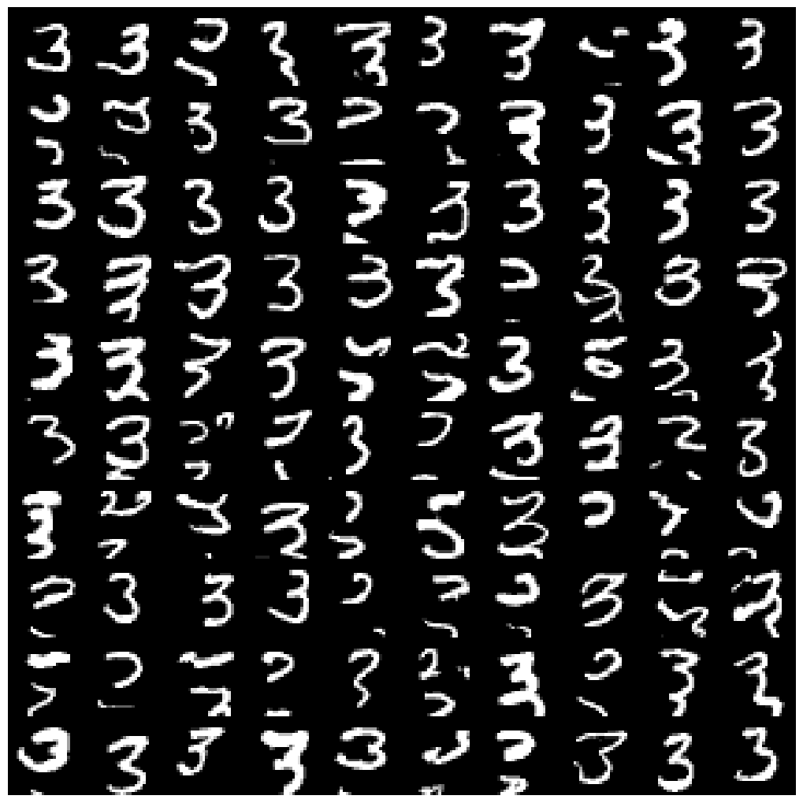
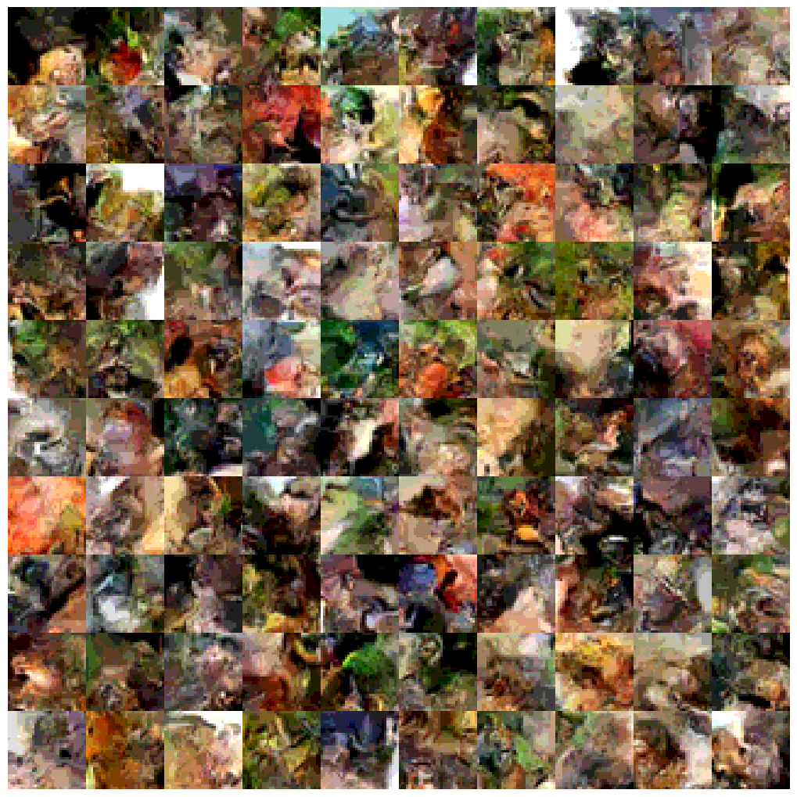
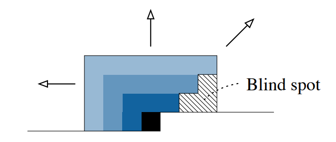
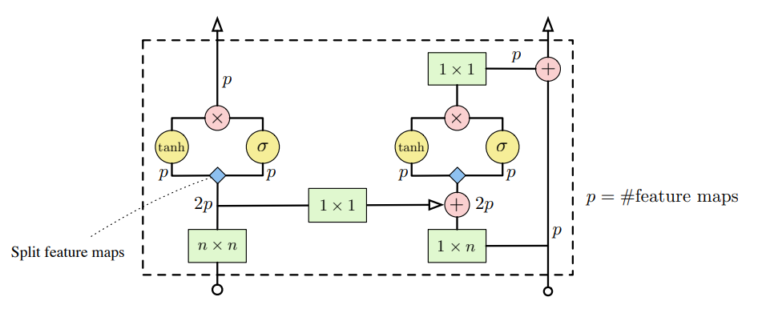
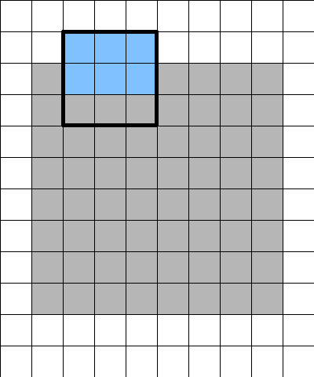
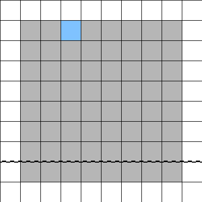
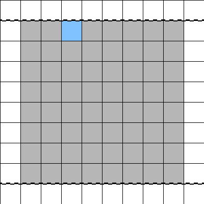
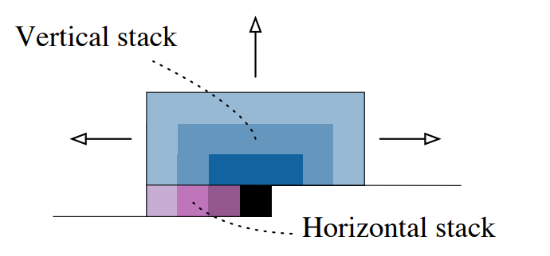
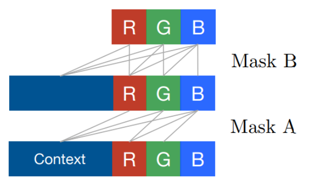

# PixelCNN

This project implements the PixelCNN autoregressive model. In particular, following [this paper](https://arxiv.org/pdf/1606.05328), we implement the improved PixelCNN model that eliminates a blind spot in the receptive field of the original model. Also [this blog post](https://sergeiturukin.com/2017/02/24/gated-pixelcnn.html) was very helpful.


We train our model on CIFAR and MNIST datasets, conditioning on labels, and generate the following results (could likely be improved by training larger model):


<table>
  <tr>
    <td>
      <br>
      MNIST model conditioning on label 3.
    </td>
    <td>
      <br>
      CIFAR model conditioning on label 'frog'.
    </td>
  </tr>
</table>


## Model
The PixelCNN model aims to capture the joint pixel distribution of given images. To do this, we use an autoregressive approach, in which the probability of observing an image $\mathbf{x} = (x_1,\dots,x_n)$ is decomposed into a product of conditional probabilities:

$$
p(\mathbf{x}) = \prod_{i = 1}^n p(x_i | x_1,...,x_{i-1}).
$$

where the pixels are enumerated in row-major order (left-to-right, top-to-bottom). 


During generation, this means the model produces pixels one at a time: it starts with the top-left pixel, and each new pixel is sampled while conditioning on all previously generated pixels.


## Implementation and Discussion of Receptive Field
PixelCNN is implemented using masked convolutional layers:
- "A" masks are used in the first layer of the network and mask out any current and future (i.e. not yet generated) information. 
- "B" masks are used in later layers and mask out only future information. 


In the original PixelCNN implementation, one way of implementing the model was to introduce masks as follows (illustrated with 3x3 convolution kernels): 

```
A mask:         B mask:
[[1,1,1],       [[1,1,1],
 [1,0,0],        [1,1,0],
 [0,0,0]]        [0,0,0]]
```

However, applying these masks introduces a blind spot in the receptive field. To see this, consider a $3\times 3$ convolution centered at some pixel of interest. With the mask applied, this pixel has direct access only to the three pixels above it and the one pixel to its left. To capture information from pixels further away, the model relies on stacking multiple convolutional layers, where neighboring pixels propagate information to each other.

But a problem now arises because of the structure of the masks: the pixel immediately above and to the right of the center pixel cannot see its own right neighbor, and so it cannot relay information from this direction to the center pixel in deeper layers. As this pattern repeats across layers, an entire diagonal region of pixels above and to the right of the center pixel is never able to influence it. This creates a triangular blind spot in the receptive field, even though the pixels in this diagonal constitute valid contextual information.

<figure>
  
  <figcaption>Figure 2: The blind spot in the original PixelCNN receptive field. (Figure taken from the PixelCNN paper) </figcaption>
</figure>


### Fixing the Blind Spot
To fix this blind spot, we split the receptive field of our model into two streams:
- a vertical stack that captures information from all rows above, and 
- a horizontal stack that captures only pixels on the current row so far.


These stacks are implemented using the following masks:
```
Vertical:       Horizontal A:      Horizontal B:     
[[1,1,1],       [[0,0,0],          [[0,0,0],
 [1,1,1],        [1,0,0],           [1,1,0],
 [0,0,0]]        [0,0,0]]           [0,0,0]]
```
Again, "A" masks are used in the first layer of the network, and "B" masks are used in later layers.

The vertical and horizontal outputs are then combined as shown in figure 3 (the $n \times n$ convolution corresponds to the vertical mask, and the $1 \times n$ convolution corresponds to the horizontal mask). We refer to the left part of the architecture as the vertical stack, and the right side as the horizontal stack.


<figure>
  
  <figcaption>Figure 3: Vertical and horizontal stacks in the improved PixelCNN.  (Figure taken from the PixelCNN paper)</figcaption>
</figure>


Of course if we use the above masks directly, the vertical stack would leak "future" information, as the center pixel has access to its right neighbor. To avoid this, we add extra padding to the input of the vertical stack, and crop the outputs immediately after the $n \times n$ convolution.


In the case of 3x3 convolutions, we use a (2,1) padding in the PyTorch sense (2 rows on top and bottom, and 1 column to left and right of input). This allows us to crop 2 rows while preserving the input dimensions. The exact cropping depends on where the vertical convolution output is routed next:
- Horizontal stack: Before combining the vertical and horizontal convolution outputs (the element-wise addition in the above figure 3), we crop the last two rows of the vertical output. This prevents any future information from leaking in to the horizontal stack.
- Vertical stack: Before passing the vertical convolution output to the tanh and sigmoid activations in the vertical stack, we crop the first and last rows. This removes the triangular blind spot as it allows the receptive field of the vertical stack to grow in a rectangular manner.


<table>
  <tr>
    <td>
      <br>
      This figure shows how we add padding (represented by white tiles) to the input of the vertical stack. We illustrate a 3x3 kernel associated with the vertical convolution with a black outline, and we color the activated (non masked) elements in blue.
    </td>
    <td>
      <br>
      This figure shows the output of the vertical convolution, and highlights in blue the element produced by the 3x3 convolution from the previous figure. The dotted line shows where we crop the image before routing the output to the element-wise addition with the output of the horizontal convolution.
    </td>
    <td>
      <br>
      This figure shows the output of the vertical convolution, and highlights in blue the element produced by the 3x3 convolution from the previous figure. The dotted lines show where we crop the image before routing the output to the activation functions in the vertical stack.
    </td>
  </tr>
</table>

In some sense, if we look only at the vertical stack (the left part of the architecture illustrated in figure 3), we allow future information to leak into the output of the current pixel, as a given pixel gets to see its own value and the values to its right. However, this is necessary in order to allow the receptive field of the vertical stack to grow in a rectangular manner. Further, since we crop appropriately before combining the output of the vertical convolution with the horizontal convolution, no future information is actually leaked. The result is that we eliminate the blind spot problem, and our receptive field evolves as expected, illustrated in the below figure.


<figure>
  
  <figcaption>Figure 4: (Figure taken from paper referenced above) </figcaption>
</figure>


## Handling RGB Input
For RGB images, each pixel consists of three values: red, green, and blue. To maintain the autoregressive property, the masks must ensure that a pixel only depends on valid "past" information. The "A" and "B" masks are extended for RGB channels as follows:

- "A" mask (used in the first layer):
    - Red: sees only past pixels
    - Green: sees past pixels and the current red channel
    - Blue: sees past pixels and the current red and green channels
- "B" mask (used in later layers): 
    - Red: sees past pixels and the current red channel
    - Green: sees past pixels and the current red and green channels
    - Blue: sees past pixels and the current red, green, and blue channels


This is illustrated in the following figure taken from [this blog post](https://sergeiturukin.com/2017/02/22/pixelcnn.html):




In the hidden layers, we preserve the autoregressive structure by partitioning channels into three contiguous groups and treating them as "red-like", "green-like", and "blue-like" channels. These hidden groups do not represent actual colors, but they allow us to extend the same RGB ordering consistently across all layers, so as to prevent information leaks. We adopt a planar layout (RRR... GGG... BBB...) rather than an interleaved layout (RGBRGB...), but either works fine.

## Label Conditioning in PixelCNN
We condition the PixelCNN on image labels by mapping each label to a learnable embedding vector. 
This embedding is broadcast across all spatial positions and added to the gated activations in both vertical and horizontal stacks.


The gated activation at each pixel ends up looking something like

$$
y = \tanh(\text{conv}_0(x) + f(h)) \circ \sigma(\text{conv}_1(x) + g(h)), 
$$

where $h$ is the embedded label vector, and f,g are learnable transformations. This ensures that each pixel depends on both past pixels and the image label.


